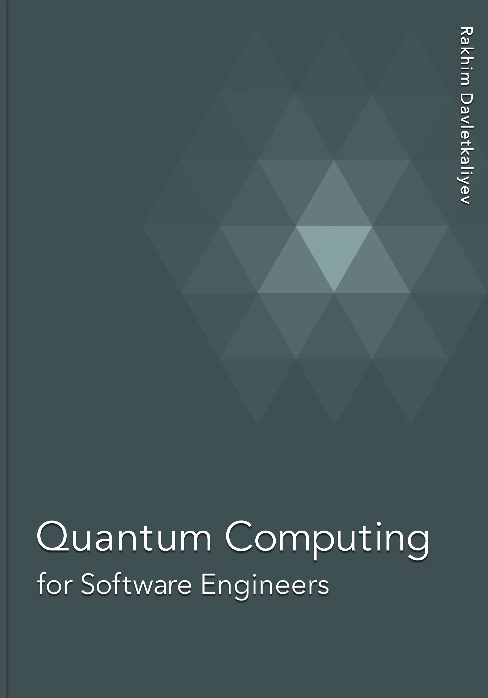

# Quantum Computing For Software Engineers

How to start a career in the quantum computing industry as a software engineer. This book is work in progress, projected completion date is November 2025. You can download PDF, EPUB and other versions here: https://leanpub.com/quantum-computing-for-software-engineers