# Preface

Quantum computing has always seemed a bit like science fiction. On one hand, there are numerous publications by skeptics—from the general public, journalists, and esteemed scientists—explaining in seemingly indisputable detail why quantum computing is at best unachievable in any foreseeable future, or at worst fundamentally impossible. On the other hand, there are dozens of companies of all sizes, from industry behemoths like IBM and Google to smaller startups focusing on one or several niche areas: algorithms, control electronics, calibration, software development frameworks, etc. The industry is experiencing quite a wave of interest, and naturally there is a lot of hype. Some companies make such bold claims that one can understand the skeptics' views, especially when those claims are not demonstrated.

So, who is right? Is quantum computing as unreal as intergalactic space travel, and do we have no chance of seeing it in our lifetimes? Or is it already here, and we just need to invest a bit more time and energy into making it practical?

This may be a bad analogy, but humor me: truly practical quantum computing may be compared to the colonization of the Solar System. In theory, it should be possible. Moreover, we have made a lot of progress in the last century and have solved many extremely hard engineering challenges, allowing us to send probes to distant worlds and even put people on the Moon. General-purpose quantum computing is like having "bases on multiple planets, with a reliable, efficient transport network." I'll be the first to admit how bad the analogy is, especially because quantum computing is simultaneously easier and harder than the colonization of the Solar System. It's easier because, just in terms of resources and the sheer number of engineering problems, it's a much smaller problem than interspace travel. It's much harder because nothing in the observed properties of physics seems to stop us from traveling in space, but the more you try to control the quantum world, the more the universe acts against your pursuit. I can believe that if humanity decides to invest one-tenth of its wealth into space travel, we may have colonies on a few planets and moons in a few decades. I am absolutely not sure the same can be said about quantum computing: investing one-tenth of all wealth may not give us a machine with a few million stable logical qubits. Space travel needs to solve very hard engineering problems, but they are the same kinds of problems that have always existed: properties of materials, energy efficiency, food production, environment preservation, etc. Quantum computing needs to solve a completely new set of challenges, never seen before.

But this is why it's such a fascinating industry.

Having said all that, I want to stress one more point: quantum computers are already useful. Although no quantum computer has helped solve real-world problems yet (such as large quantum simulations, optimizations, NP-hard problems, cryptography, and other areas promoted by the hype), companies and scientific organizations purchase quantum computers to do research. Today, most QC devices can be considered research tools. There are three main areas of research:

1. Quantum physics
2. Quantum computing
3. Integration

Since quantum computers are essentially analog devices that allow you to control, in a limited fashion, a set of quantum objects, you can do some research in foundational quantum physics. Certain things that require tremendous computational resources on a classical computer may be done easier and faster on a quantum computer. Still, given the current state of the industry, classical computers outperform most quantum systems. But the research applied to smaller QCs can be scaled once the hardware scales.

Of course, the main area is quantum computing itself. From abstract, mathematical notions of algorithms to very low-level questions of calibration, many universities and research organizations are eager to have a quantum computer available to prove their theories and discover new properties. Commercial companies that deal with material science, battery technology, agriculture, and chemistry are buying quantum computers (or at least buying access to one) because they want to be ready if and when truly large-scale QCs become available. It is known that with a robust, large-scale QC one can develop, for example, better chemicals or EV batteries by efficiently simulating complex molecules and their interactions. Although you can't do it today, you can start developing the organizational knowledge and apply it to smaller-scale issues, in the same fashion as many organizations decided to try to "play" with the first computers back in the day, and as a result came better prepared for the digital age.

And finally, integration research. This is the least known and least discussed topic in the industry but is very important. Its significance is one of the motivations for writing this book. Quantum computers, being research tools, are not normal products. They are driven by software, like anything else, but this software changes rapidly and is rarely written with long-term evolution in mind. If you buy a quantum computer today, chances are your code will not work on any other quantum computer, or even on the next iteration of the same machine. At the same time, researchers often need to work with multiple types of machines simultaneously, and HPC (high-performance computing) centers, i.e. supercomputing data centers, want to integrate quantum computers into their existing infrastructure and provide a "quantum compute" service to their users.
{pagebreak}

---

In the following chapters we will learn the principles behind quantum computers, and some practicalities as well. Before diving in, it's important to keep in mind the following unfortunate facts about the current state of the art.

1. Noise and error rates are overwhelming.
2. The amount of qubits is not a meaningful metric alone.
3. Many current architectures are ultimately no scalable.

First, you'll often hear about "noise" in quantum computing, as well as "error rates" and "error correction" (as well as "error mitigation"). This refers to the fact that quantum systems are inherently difficult to control and keep in a particular state, so whatever information is stored in it, or whatever computation happens, the results are often wrong. But as long as the results are *mostly correct*, there is a way to make it practical.

Second, most quantum hardware companies focus on the number of qubits as a metric of their progress. They themselves of course know better that this metric alone is not very meaningful, but it's understandable that press and media would use it: it's so simple and straight-forward. Just like in the past CPU manufacturers would reveal more and more megahertz and gigahertz, roadmaps and press-releases of IBM, Google, Rigetti and others contain quantum processors with 5, 20, 150, 433, 1121 qubits and beyond. Unlike "hertz" in CPUs, or "bytes" in RAM or disk storage, qubits, at least for now, are not created equal. In superconducting quantum chips (the most popular architecture at the moment) each qubit is uniquely imperfect. The fabrication process is difficult, and often a portion of planned qubits simply don't make it. The lab may try to make a 100 qubit device, but it ends up with e.g. 94 qubits, with 6 permanently "dead". Moreover, some of the remaining alive qubits would be of better quality than others. Some would have longer coherence time, i.e. would hold the state longer. Some would have better suited for certain operations. It may be possible that some computational operations are only available on a subset of qubits. To drive the analogy home, imagine that when you buy a new AMD or Intel CPU, it's clock speed, the number of registers, and the instruction set is unique to this unit. Your friend who bought the same product would get a slightly different "snowflake" chip. And now imagine writing an operating system for this madness.

Third, a lot of current approaches are simply not scalable to the desired levels of practicality. Yes, 1000+ qubits from IBM sound impressive, but true utility requires orders of magnitude more. Even if the fabrication process improves significantly, and it becomes possible to make 1 million qubit chip, it'll be practically impossible to engineer a cryostat large enough for the millions of cables required to connect the chip to a huge number of control electronic units.

# Chapter 1. Groundwork

- gaming die analogy?

In this chapter we are going to learn the basics of quantum physics and quantum computing. And I mean very very basics, in a popular science way. This is not a replacement to even a first week of introductory university lectures! Luckily, there are enormous number of free resources available online and in libraries. Some recommendations are at the end of the book.

For us it is important to understand the following:

- what qubits are modelled after
- what are quantum gates
- how to implement a qubit with superconductive materials
- what other implementations exist

{pagebreak}

## Quantum physics 101


*What exoplanet WASP-39 b could look like, based on current understanding. Credits: NASA, ESA, CSA, Joseph Olmsted (STScI)*

This is an artist's rendition of an exo-planet with the coolest name WASP-39 b and its star. They are located about 700 light years from Earth. That is 6.62 quadrillion kilometers. For comparison, Jupyter is roughly 40 light minutes away from Earth. So, yeah, WASP-39 b is very far. So far that we can only look at this artistic rendering because no optical telescope can photograph it in any meaningful level of detail. It's gonna be at best a bunch of pixels. However, if you search for scientific publications about this planet, or many other distant exo-planets for that matter, you will find some surprising depth of detail about the chemical composition of their atmospheres. On WASP 39 b NASA found sodium, potassium, carbon dioxide, carbon monoxide and other elements.

How?!

You can barely see the planet, it's a blurry set of pixels, yet we know what kinds of molecules can be found floating above it. This seems unreal. The answer to the "how" question is... spectroscopy. It's a technique that takes advantage of a peculiar property of quantum objects. Scientists had discovered this almost a century ago, and you may have learned it in high school.

Consider an atom of sodium. It has 11 electrons around the nucleus. Now shine a light in a wide spectrum onto it. Wide spectrum means there are photons of different frequencies, or in other words, of different colors. Low frequencies are towards red color, high frequencies are towards violet color. By the way, this is where terms "infrared" and "ultraviolet" come from: infrared is "so red" that it goes below the capabilities of the human eye, and it's very low energy, for example, emitted by warm objects; and ultraviolet is so above the visible light and of such high energy, it is dangerously destructive.

So, you shine these photons of various frequencies through the atom and look at the light on the other side and notice that some parts of the light are gone. Before the atom you had a nice continuos spectrum, and after the atom there are these black gaps of no light. Photons of certain frequencies did not make it through.

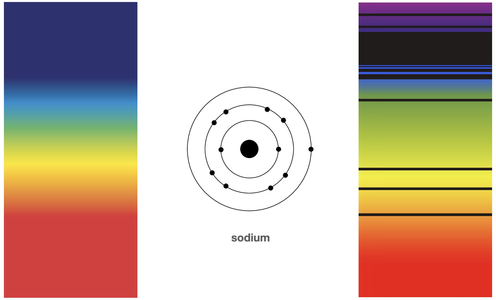

Turns out that photons of certain frequencies got absorbed by certain electrons of that atom. The energy of the photon went into an electron and made it move into a higher energy position. The electron got excited and could not hide it. The resulting pattern of light looks like a barcode and, in essence, it's exactly that. A unique identifier, like a fingerprint, of the sodium atom.

Once the electron goes into a higher energy state, it usually "wants" to go back down, and it does so spontaneously at some point. One of the fundamental laws of the universe is the conservation of energy, so when it falls back to the lower energy state, the same amount of energy that made it excited in the first place is re-emitted in form of a photon indistinguishable from the original one. So later you may track a series of emitted photons that form a broken spectrum that looks like the inverse of the "barcode".

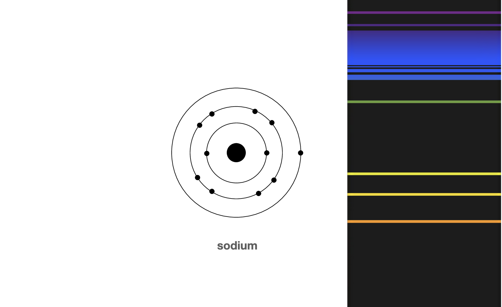

We have (or can produce) most of the elements here on Earth, so scientists repeated this experiment for all of them and compiled a database of fingerprints for each one.


Now instead of using an optical telescope, NASA used a set of specialized telescopes that can detect variations in the electromagnetic radiation spectrum, and managed to do so in the exact moment when the WASP-39 b's mother star shines through its atmosphere. The resulting light has those exact bar codes for sodium, potassium, etc.

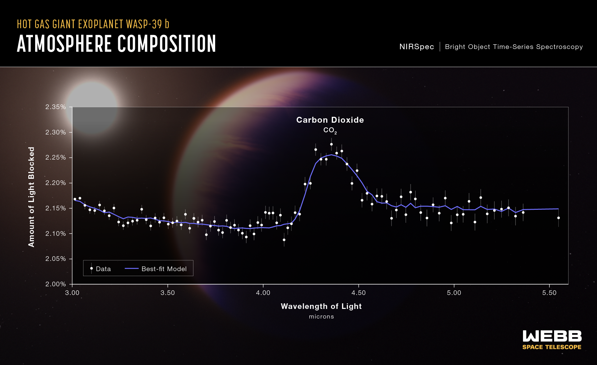
*A transmission spectrum of the hot gas giant exoplanet WASP-39 b captured by Webb’s Near-Infrared Spectrograph (NIRSpec). Credits: NASA, ESA, CSA, Leah Hustak (STScI), Joseph Olmsted (STScI)*

This is truly amazing! And if we could simulate these interactions between light and electrons, or more generally, simulate quantum interactions, on a regular computer, we could develop better materials, chemicals, pharmaceuticals, design more efficient car batteries and discover better processes for growing food. Simulating would be so much simpler, faster, and cheaper than actually experimenting and producing those new materials and chemicals in real life. Imagine designing new drugs by precisely modeling molecular interactions, or discovering novel materials with extraordinary properties before ever synthesizing them in a lab.

The description of the process seemed pretty straight-forward, right? Feels like we could easily simulate this with an if-else. There is some state, and known energy levels, and if they match, then the state is changed.

When scientists started to think about this problem — and they started a long time ago, when computers were barely a thing — they realized that even if computers become billions of times faster, it still won't be enough. The problem is that the state of a quantum object is not discrete like we have observed, it's not just 0 or 1, ground or excited. And I don't mean that there are more states: yes, there could be more discrete states (think 0, 1, 2, etc.); those two or more discrete states can be observed, but in order to simulate a quantum system, you have to express and store the state before the observation. And according to quantum physics, the state is expressed with a formula that happens to be the same as for describing waves, like that of water on the surface of a lake.

For a system that can be observed in one of two states, like that electron, to fully express the state you need to store two complex numbers called amplitudes. The formula below contains a so-called bra–ket notation, also called Dirac notation.

```latexmath
|\psi\rangle = \alpha |0\rangle + \beta |1\rangle
```

To simplify, we can think of them as probabilities (in reality they are numbers from which you can calculate probabilities, but this distinction is not very important right now). So, the true state is not zero or one, but instead a probability distribution that tells you how often would you observe zero and how often would you observe one if you had an opportunity to measure the state multiple times.

A complex number is like a 2-dimensional number. It's an extension of real numbers (those that may have digits after the dot, like `14.665` or `3.14`). A complex number is a combination of some real number and an imaginary number; every complex number can be expressed in the form `a+bi`, where `a` and `b` are real numbers, and `i` is such a number that multiplying it by itself results in `-1`.

"There's Plenty of Room at the Bottom: An Invitation to Enter a New Field of Physics" was a lecture given by physicist Richard Feynman at the annual American Physical Society meeting at Caltech on December 29, 1959. He imagined nanoscale machines capable of direct manipulation of individual atoms and producing materials of any kind on demand; and tiny surgical robots that would be ingested by a patient and perform operations on the smallest scale inside the body.

Two decades later, as computers became more viable and scientists and engineers started to see the limitations on the horizon, Feynman presented "Simulating Physics with Computers". He explained that classical computers can efficiently simulate classical physics; that is, physics models prior to quantum, such as Newton's laws of motion. After the discovery of quantum mechanics, it was clear that classical physics is merely an approximation, albeit a very good one. Newton's laws of motion can be used to successfully travel to the moon and back, because the approximation is good enough at that scale. But if we want to simulate complex quantum systems, or the long-term evolution of the universe, these approximations fall apart. Feynman then proceeds to argue that classical computers can still be used to simulate true quantum systems, because in the end the laws of quantum physics are just mathematical equations parametrized by time. I.e. you can calculate true quantum states by hand with a pen and paper. Computers are pretty good at math, and are certainly faster than humans, but here comes the critical part of Feynman's 1981 paper: computers are still too slow and too small.

This isn't a 1981 problem. Sure, computers were orders of magnitude slower back then compared to today, and had much smaller memory to work with. Feynman and his colleagues could project the growth of computer architecture and still see that exponential growth in computational power and memory is required. A system of N quantum objects requires describing `2^N`$ amplitudes.

You can consider the size of the universe and roughly calculate how a computer can be built in principle. A classical computer of the size of the universe would have huge, but still limited powers and memory. You can then consider a relatively modest quantum system that needs to be simulated, and realize that even the computer of the size of the whole universe is not enough.

Yet this "computation" happens! The universe itself can be viewed as a computer that calculates the evolution of everything every "tick" and at every point in space.

Thus the only way forward is quantum computers: machines that themselves operate on quantum object, using them to store information and perform computation. So, instead of using many bits to describe the state of a single quantum object, a quantum computer would use a single qubit - a quantum bit. The challenge is, of course, how to get and control those qubits. Perhaps, just get those atoms with their electrons?

This paper can be considered the founding document of the field of quantum computation, a new kind of computation designed not just to crunch numbers, but to emulate the very fabric of the quantum world.

{pagebreak}

## Qubits and quantum gates

Before we go into practical matters of building and operating a real quantum computer, let's simply assume one exists. How would it look like from the point of view of a programmer? What computing primitives would be offered?

In classical computing there is a clear and simple model of logical gates: `AND`, `OR`, `XOR`, etc. All programming languages offer such operations, but the important part is that processors themselves offer those operations. One can build those gates physically with electric circuits or even large-scale objects like dominoes.

A very limited number of gates (called "basis gates") can be used to express all other gates, and the rest of computing. All the math necessary to build any software from "Hello, World" to operating systems can be decomposed to a small number of logic gates. For example, an adder of two binary numbers can be constructed with two `XOR` gates, two `AND` gates and an `OR` gate.

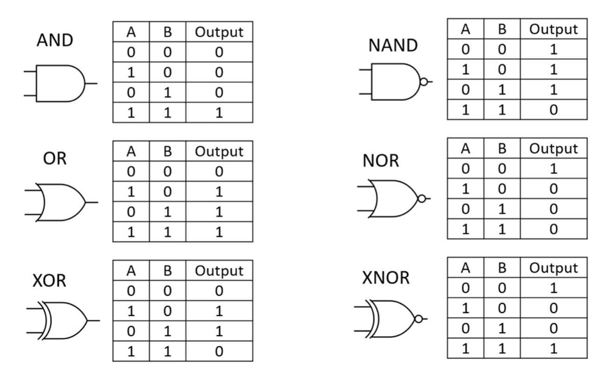
*Basic logic gates. Credits: gsnetwork.com*

In a similar fashion, there is a notion of quantum gates. Just like logic gates, quantum gates come in different forms: some operate on a single qubit, some on pairs, some on three or more qubits. You can think of a gate as applying an operation to qubits, so the state of the qubit before and after the gate may differ. The most important part to understand here is that gates do not operate on observed bits, but on unobserved quantum states.

A classical logic gate can either change the bit or leave it unchanged. The result if always either `0` or `1`. But the result of applying a quantum gate is just a different state among virtually infinite number of possibilities. Say, the state of a qubit was `\alpha |0\rangle + \beta |1\rangle` before the gate, and became `\alpha\prime |0\rangle + \beta\prime |1\rangle` after the gate: slightly different complex numbers. This can already tell you how much more information and computation is packed into a quantum computer.

Unlike many classical logic gates, quantum logic gates are reversible. It means that no information is ever lost in the process of computation until the measurement (observation) is performed. Compare this to e.g. an `AND` gate: its output is a single bit from which it may be no way to reconstruct the inputs. However, it's still possible to perform classical computing using only reversible gates.

This reversibility requirement has practical consequences. If information somehow manages to escape the system during computation it means the state was observed (e.g. by the environment into which the information had escaped), and thus the fragile quantum system had experienced decoherence and the complex amplitudes are gone; no quantum computation can be done at this point, only classical bit manipulation. Thus, the quantum computer must be completely isolated from the rest of the universe. In practice, depending on the architecture, it may require physical isolation from electromagnetic radiation, from any particles (so, a vacuum is required) and from any energy (so, a near absolute zero temperature is required).

Qubit can be modeled mathematically in different ways. One way is a Bloch sphere, named after the Swiss-American theoretical Felix Bloch.


It's a sphere, like a planet, and there's a vector pointing from the center to the surface. It can point to any position on the surface, and each such possibility represents one state. When it points straight to the north pole it represents the state `0`, and when it points straight to the south pole it represents `1`. If the vector points to anywhere on the equator, exactly in between the `0` and `1`, then there an equal 50% probability of observing the state in either `0` or `1`. When observation is made, it is always either `0` or `1`, and you never see the vector pointing anywhere else. But before the observation, the vector can point anywhere, and applying quantum gates can change where the vector points to.

Do not let the visual nature of Bloch spheres mislead you. A planet-like sphere does not mean the qubit is a spherical, or has any sort of meaningful orientation in space, or a direction. The Bloch sphere is as abstract as it gets, and is just a way to visualize numbers.

A nice thing about vectors is that they can be described as matrices (or rather, columns of a matrix). Quantum gates can be described as simple or complex matrices, and this gives us a nice model of applying gates: multiply the state vector by the gate matrix, and the result is the new state. This is how you can do quantum computing on paper: it's just linear algebra!

Similar to classical logic gates, we can take a limited amount of quantum gates — a universal gate set — and use them as a foundation to describe all other gates, and as a consequence, the entirety of quantum computing.

A quantum program looks a bit like musical notation. Horizontal lines are qubits, and elements on them are gates. Time goes from left to right. This representation is called a quantum circuit. Generally, it does not have a notion of timing, only relative timing. It means that the order here matters, but the exact number of seconds (or rather nanoseconds) between the operations is not part of the circuit.

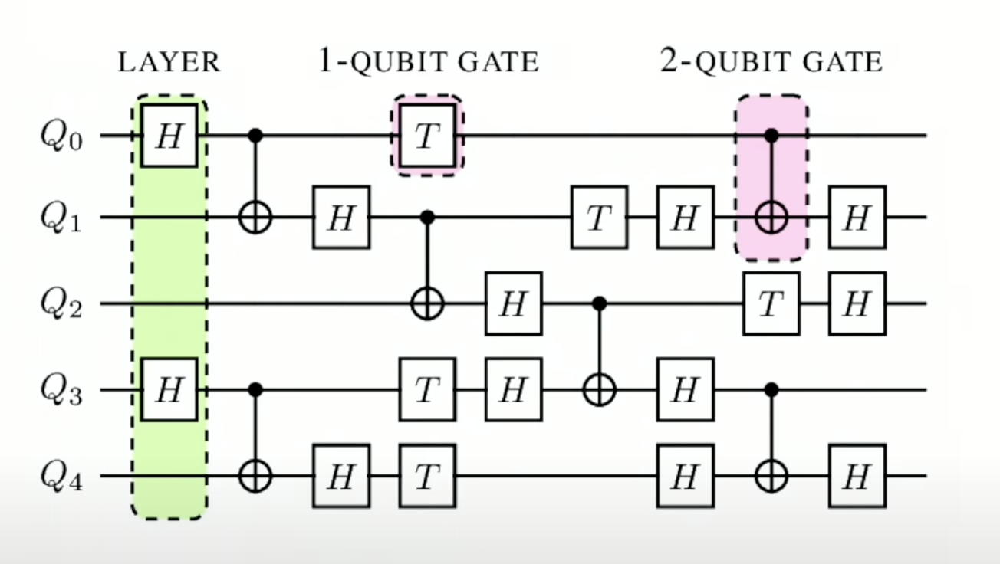
{pagebreak}

## Crafting a qubit with superconductivity

Quantum computing is often imagined as something delicate and ethereal: electrons hovering in superposition, photons zipping through fiber-optic mazes. The sodium atom we've considered earlier, together with its electrons, is just another example of a "natural" qubit.

And while those images reflect real research directions, one of the most powerful approaches to building quantum computers is surprisingly tangible: circuits made of wire and metal, etched onto chips. In this chapter, we explore how quantum information or the elusive qubit can live not just in particles, but in entire electrical circuits, made practical by the strange and remarkable world of superconductivity.

For me this fact was probably the most mind-blowing. I knew about quantum computers in general before starting to work in the industry, but I always thought a quantum computer is built with stereotypical quantum things. The majority of popular science books and even university textbooks always describe quantum physics via properties of photos and electrons, so naturally when it comes to utilizing the quantum effects for computation, the same objects are re-used. Apart from engineering concerns, it doesn't really matter which one to use, just like with classical computers we could built processors out of vacuum tubes or transistors or dominoes. The theoretical computation is equivalent, but the engineering tradeoffs are huge.

At its core, a qubit is just a two-level quantum system. Any physical object that is capable of existing in two distinct quantum states—and, crucially, in superpositions of those states—can serve as a qubit. Electrons, with their spin states, or photons, with their polarization, are natural candidates. But quantum mechanics doesn't limit us to the microscopic. With careful engineering, even something as macroscopic as a loop of wire can be coaxed into behaving quantum mechanically.

Indeed, we can create a qubit out of a simple electrical circuit, such as a loop containing a capacitor (usually denoted `C`) and an inductor (usually denoted `L`). The capacitor stores energy in an electric field, the inductor in a magnetic field. Together, they form an LC oscillator—essentially a quantum harmonic oscillator when cooled and isolated enough. The energy in this circuit oscillates back and forth between the electric and magnetic fields, just like a mass on a spring.

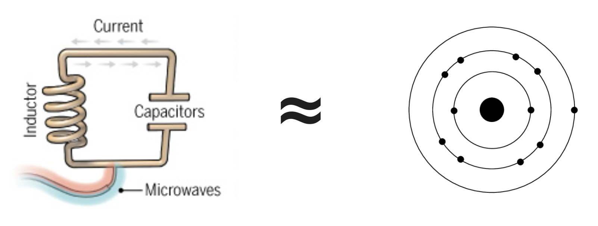

But real wires aren't perfect. In ordinary circuits, resistance drains energy over time, converting it into heat. This dissipation erases the quantum information stored in the circuit's oscillations. A qubit that leaks energy is like a memory cell that forgets its value—it's useless for computation.

To maintain coherence or the ability to hold quantum information we need to eliminate resistance. Luckily, the rules of the universe happen to have a property that can help us: superconductivity.

Superconductors are materials that, when cooled below a certain temperature, exhibit zero electrical resistance. Current can flow essentially forever in a superconducting loop without any loss. When we build our LC circuit from superconducting materials, we get a high-quality quantum oscillator that can retain energy—and quantum information—for much longer.

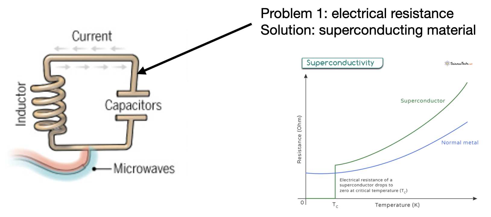

With superconductivity, our circuit is no longer just an analog of quantum mechanics—it becomes a bona fide quantum system. It exhibits quantized energy levels, and under the right conditions, can even show superpositions and entanglement. But there's still a problem: such a circuit has evenly spaced energy levels. It's like a ladder with rungs at perfectly regular intervals. That's fine for physics experiments, but not great for quantum computing.

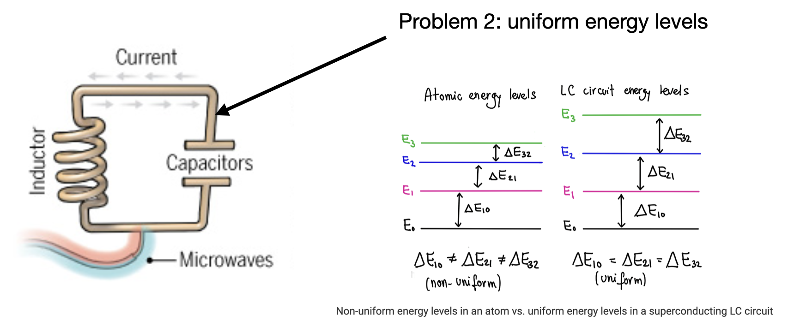

To perform quantum gates, we need to isolate just two energy levels—say, the ground state and the first excited state—and control transitions between them. But in a harmonic oscillator, applying energy that flips the qubit from |0⟩ to |1⟩ can just as easily excite it from |1⟩ to |2⟩, or beyond. That means our circuit isn't just a qubit—it's a “qutrit,” or worse. It's hard to address just two levels in a harmonic system. To solve this, we need to make the energy levels uneven—_anharmonic_.

The breakthrough came with the Josephson junction: a thin insulating barrier between two superconductors. It behaves in a non-linear way, introducing exactly the anharmonicity we need. By adding a Josephson junction to the circuit we create a non-linear oscillator whose energy levels are no longer equally spaced.

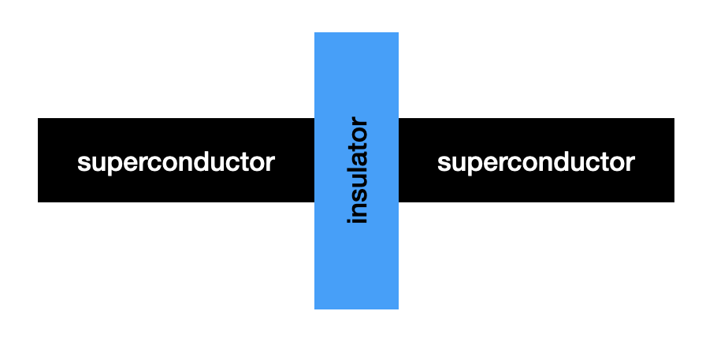

Now, the transition from |0⟩ to |1⟩ requires a different energy than the transition from |1⟩ to |2⟩. This spacing allows us to selectively excite and manipulate just the lowest two levels, effectively creating a true qubit. These are called _transmon qubits_, one of the most widely used types in today's superconducting quantum computers.

Note that accessing higher state like |2⟩ can still be useful for certain areas of research and even for certain computational tasks. Some scientists working on simulating chemical reactions would like to be able to access higher states inside of a quantum processor because those state might have better correlation to the underlying models they're trying to simulate. But for general purpose quantum computing, just two states  |0⟩ and |1⟩ are enough, and unlocking higher states does not expand the domain of problems that can be solved.

There are different ways to implement superconducting qubits, depending on which variable—charge or flux—you use to store and manipulate quantum information.

- **Charge qubits** rely on the number of Cooper pairs (paired electrons) on a small superconducting island. They're sensitive to charge fluctuations, which can be both a blessing and a curse. While they can be manipulated quickly, they're also vulnerable to noise.
- **Flux qubits**, on the other hand, encode information in the direction of current flowing around a superconducting loop. This current generates a magnetic flux, hence the name. Flux qubits are typically more robust against charge noise, but can be more complex to control and fabricate.

There's a third kind, called the _phase qubit_, which uses the phase difference across a Josephson junction as its state variable. And the _transmon_ qubit—a sort of refined charge qubit with reduced sensitivity to noise—has become the dominant platform in many quantum computing systems today.

Don't worry, we don't have to dive much deeper than this. I mean, you totally can if this sounds interesting, but we are going to move up the ladder of abstraction now and start treating qubits as generic objects with certain limited amount of properties. However, you will soon start noticing that in modern quantum computing most abstractions leak, both upwards and downwards.

{pagebreak}

## Other modalities

This section will give a short overview of other modalities.

### Trapped Ions

Trapped-ion quantum computers use individual charged atoms (ions) as their physical qubits. Certain properties of the atoms are used to represent the state, and they happen to be stable and well-isolated from environmental noise (e.g., magnetic field fluctuations). This results in the longest coherence times (3$T_2$) of any leading qubit modality, often measured in seconds or even minutes. Compared to superconducting quantum computers, trapped ions enjoy orders of magnitude longer coherence. However, the time it takes to perform any operation on qubits is longer as well. Operations are executed by directing precisely tuned lasers at individual ions.

### Quantum Dots

### Topological qubits

### Annealing

{pagebreak}

# Chapter 2. Levels of Abstraction of a Superconducting Quantum Computer

This is the most important chapter of the book. We are going to traverse the full path from an abstract quantum algorithm, to code, then go through multiple transformations and compilation steps, all the way to "bare metal" of the control instruments and the quantum chip, then raise back up into tangible data. At each step, we will zoom in and explore little details and caveats.

{pagebreak}

## Abstract circuit

This section is vaguely based on an illustration I had made for IQM Quantum Computers back in 2022 titled "The Journey of a Quantum Algorithm". Although it is somewhat tied to the particular architecture and implementation of IQM's machines as of 2022, the overall structure is fundamental to all superconducting quantum computers, and many parts apply even to other types of QCs.

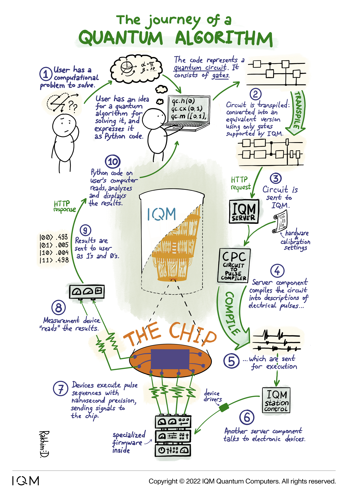

It all starts with the user having an idea. Just like with regular computers, the task often comes down to converting a mathematical description of an algorithm into actual code. Today most likely this means writing code in Python and using some popular quantum computing SDK (software development kit) like Qiskit (see Chapter 3 for more details on various SDKs and formats).

There are different ways to express a quantum program, but as of today the user is most likely to define a quantum circuit. The definition looks slightly different depending on the platform and language, but follows the same basic structure: there are qubits and gates. An aptly named single-qubit gate is applied to a single qubit only, two-qubit gates to two, and so on. Consider this abstract code that vaguely reminds of Qiskit:

```
circuit.h(0)
circuit.cx(0,1)
circuit.m([0,1])
```

The first line adds a Hadamard gate to qubit `0`. The second line adds a two-qubit CX gate to qubits `0` and `1`. The last line adds a measurement gate to qubits `0` and `1`. Tools like Qiskit can generate visualizations of circuits, and our example would look like so:


The red square represents the Hadamard gate, and the blue structure connecting the two qubits represents the `cx` gate; in this notation, the smaller blue dot denotes the source qubit, and the bigger circle with a plus sign denotes the target qubit.

The two grey boxes on the right are the measurements; the icons inside the boxes look like dial gauges.


The vertical line separating the gates is called a barrier. We'll discuss it in more detail later while talking about optimization. Note that it was added automatically by Qiskit, and this is a pretty common behavior.

### Hadamard gate

Usually, the assumption is that all qubits start in state `0`. The Hadamard gate transforms such state into a superposition of `0` and `1`. This means that if you measure it you will get `0` with 50% probability or `1` with an equal 50% probability. Just repeating this process over and over is akin to flipping a coin.

We can visualize the qubit's initial state of `0` (ground state) as a Bloch sphere with the vector pointing to the North pole:

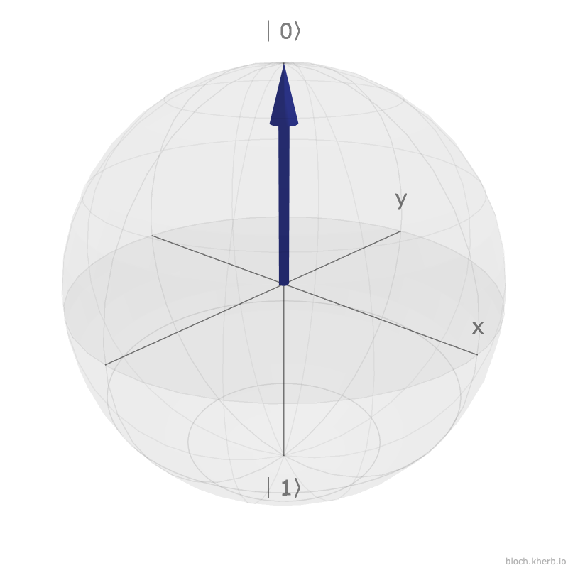

The Hadamard gate rotates the qubit so that it points onto the equator. The blue line signifies the trajectory or the path of that rotation across the surface of the sphere:

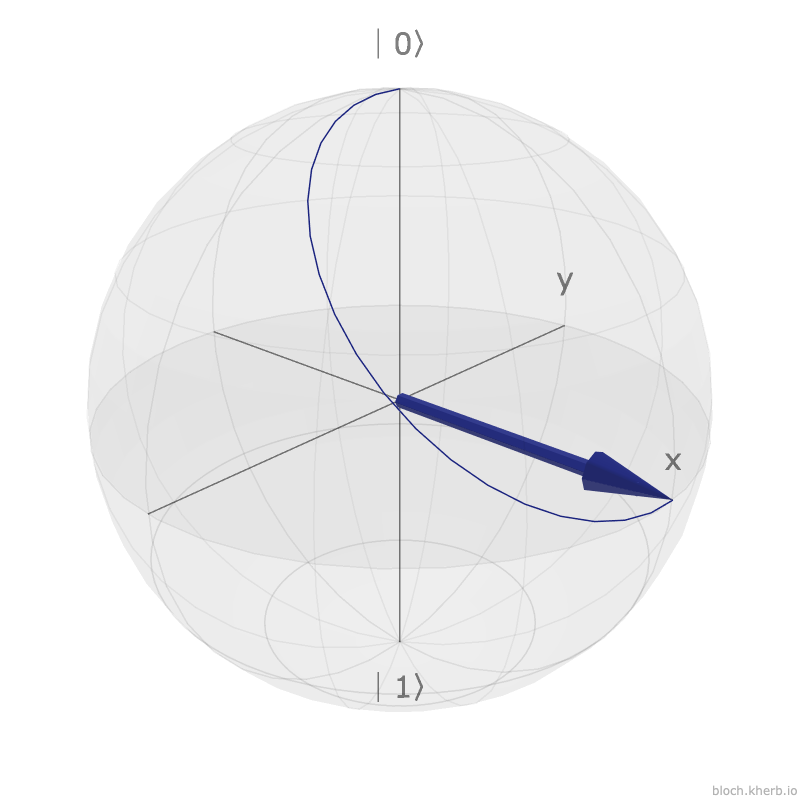

Remember, when the qubit is measured, its state can only be one of the two: either `0` or `1`, i.e. either north pole or south pole. The state after applying the Hadamard gate is not observable, it only exists as long as the qubit stays isolated from the universe inside a functioning quantum computer. Intuitively, having the arrow point to the equator means that upon observation the arrow has 50% chance of collapsing into `0` and 50% chance of collapsing into `1`. It is now perfectly between the two states, or in other words it's in a superposition.

The Hadamard gate can be expressed as a 90º rotation around the Y-axis, followed by a 180º rotation around the X-axis. You might wonder why do a 180º rotation around the X-axis: this doesn't move the arrow as it is pointing exactly in line with the X-axis.

The Hadamard gate applied twice should return the qubit into its initial state. This means that the state is not really lost after putting the qubit into a superposition, and the operation is truly reversible. But if the operation was only a 90º rotation around the Y-axis, then applying it again would put the state into the opposite value. The image below illustrates this.

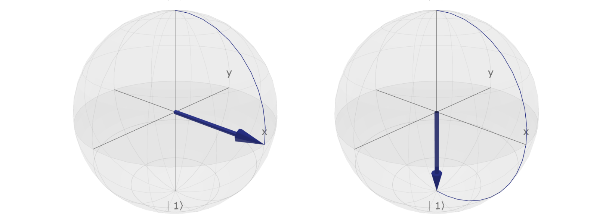

The Hadamard gate on the other hand always restores the initial state when applied twice, regardless of the initial position. Here are some examples:


### CX gate

The `cx` gate is a conditional flip. Think of it as:

```
if (qubit_0 == 1):
	flip(qubit_1)
```

The measure gate is a command for the instruments to read the state of given qubits and send the data downstream for post-processing. This is a destructive operation, because the complex quantum state is destroyed upon observation. So, our qubit 0 being in a superposition thanks to Hadamard gate will collapse to one of the two possible states and no longer be in a superposition.

Here is the weird part, or at least it was for me: the `cx` gate is **not** "measure qubit 1 and if it is 1 then flip qubit 2". There is no measurement involved in that condition! After `cx` gate is applied to the pair of qubits, the state of qubit 1 is tied to the state of qubit 0, but the state of qubit 0 is undetermined. Now, according to the theoretical mathematical models, measuring those two qubits should always yield the same pairs: either both `0` or both `1`.

Running a circuit just once rarely makes sense. We want to see a good statistical proof, so we should run the circuits hundreds or thousands of times in a row, collect all measurement results and observe the stochastic patterns. The number of executions is usually called "shots", and quantum APIs offer an argument with that or similar name. In abstract, sending a circuit for execution may look like this:

```
results = qc.execute(shots=10000)
```

The results can be:

- a complete raw blob of measurements from all shots, i.e. data like `[0,0], [0,0], [1,1], [1,0],...`
- a processed histogram in a compact form stating how many results of each kind were obtained, e.g. `{[0,0]: 4883, [1,1]: 4912, [1,0]: 99, [0,1]: 106}`
- normalized histogram showing observed probabilities, e.g. `{[0,0]: 0.4883, [1,1]: 0.4912, [1,0]: 0.0099, [0,1]: 0.0106}`
- some other application- or algorithm-specific format. This may include "rawer" data read from the qubits without post-processing, but we're not gonna discuss those now.

Let's construct a slightly more complex circuit and use it as the example in our journey down the ladder of abstraction.

```
circuit.h(0)
circuit.cx(0, 1)
circuit.cx(0, 2)
circuit.m([0,1,2])
```


We put qubit `0` into a superposition by applying the Hadamard gate. Then apply the `cx` gate to pairs `0`-`1` and `0`-`2`. Essentially, we have entangled the qubits, and we expect the resulting measurements to always yield either `000` or `111`.

Note the measurement gates in the visualization above. They have vertical lines leading down somewhere. The image is actually cropped; the complete version looks like so:


Recall that these visualizations are done by Qiskit, a popular quantum SDK. Qiskit's interface is built around the idea of quantum and classical registers, which vaguely remind of CPU registers, as well as measurement keys to identify the qubits from which a particular measurement outcome was gathered. The full image shows that qubits `0`, `1` and `2` were measured into keys `meas_0`, `meas_1` and `meas_2`, respectively.

Since in this book we try to focus, as much as possible, on the universal concepts rather than particular designs or implementations, we are going to ignore those parts and focus on qubits and gates only. The Qiskit visualizer is handy, though, so we'll continue cropping the images.

{pagebreak}

## Transpilation, routing, and optimization

Now that we have a quantum circuit, it may seem like it should be straight-forward to "apply" it onto a physical quantum chip. But it's not; or at least, not usually.

When hardware vendors design and build quantum chips and control electronics, they usually have a small set of operations in mind. Let's call them "native operations" or "native gates". This set needs to be universal, in other words, it should be possible to represent any operation from the theory of quantum computing as a combination of native gates.

This, once again, is very similar to logic gates of classical computers. If you're building a CPU, then you can choose to support `AND`, `OR` and `NOT` gates only. All other gates (e.g. `XOR`, `NAND`, etc.) can be expressed as combinations of those universal gates.

Note that the choice of native quantum gates is not set in stone. It's not a physical property of the chip, or the manufacturing process. It's implied by those physical properties, but is ultimately driven by calibration.

The quantum computer at this moment in time may report that it supports only `PRX` and `CZ` gates. So, how do we run our Hadamard- (`H`) and CX-based circuit there? We first must convert those gates into an equivalent native gates. This process is usually called transpilation, although some vendors use different terms such as synthesis.

Transpilation in computing usually refers to a process of converting source code from one language to another language on the same level of abstraction. For example, transpiling TypeScript code into JavaScript. As opposed to compilation, which usually refers to a process of converting source code from one level of abstraction onto a lower level. For example, compiling Java code into bytecode.

Transpilation can be done by hand, but quantum SDKs like Qiskit and Cirq have a transpiler module built in. It needs to know what is the native gateset of the target machine, and if there are any specific rules that define transpilation. Most vendors ship special adapters for Qiskit and other popular frameworks that allow to easily transpile circuits into their target architecture.

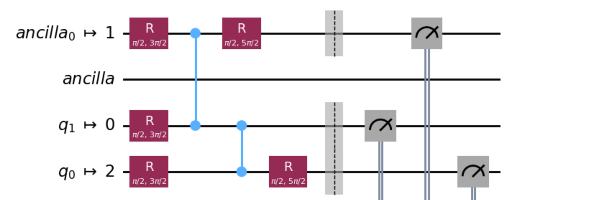

This transition from "abstract qubits in vacuum" to real qubits on a real chip involves another step: routing. When we were defining our circuit, we did not think about connectivity. Or rather, we assumed that all qubits are inter-connected, and we are allowed to apply e.g. two-qubit gates on any two pairs of qubits. Our toy example only had two qubits, but even there we made this assumption. In reality, the connectivity of superconducting chips is heavily limited. Here is the topology of a typical 5-qubit chip:

```
      QB1
       |
QB2 - QB3 - QB4
       |
      QB2
```

There is no direct connection between qubits 1 and 2, so an operation `cx(1,2)` is not physically possible. Assuming the user does not really care which physical qubits are used for the computation, one obvious way to map the circuit onto this topology is to choose a pair that is physically connected, for example `QB3` and `QB4` and assign "logical" qubits to physical qubits like so:

- logical `qubit 1` → physical `QB3`
- logical `qubit 2` → physical `QB4`

(Note that we use the term "logical qubit" to denote a single qubit in our primitive circuit; there is another, more common meaning for this term that is related to quantum error correction, in which a single logical qubit can be mapped to multiple physical qubits in order to achieve redundancy and better fidelity. This approach is similar to classical computing where in order to minimize noise and random errors, a single bit of information is stored in multiple bits of physical memory, and extra bits are used to correct potential spontaneous errors or bit flips. Since this book is mostly focused on the current state of the quantum computing industry where true quantum error correction, or fault-tolerant quantum computing, is not yet a complete reality, we are going to keep using the term "logical qubit" like we did. We will also discuss quantum error correction in the latter chapters.)

Our case was very simple, but now consider this circuit:

```python
circuit.cx(1,2)
circuit.cx(2,3)
circuit.cx(1,3)
```

We want to apply two-qubit gates on pairs `1,2`, `2,3` and `1,3`. It is not possible to map this to the given topology because it requires this kind of loop:

```
QB1 ----- QB2
 |         |
  -- QB3 --
```

Thankfully, there is a way around it: swap the state between qubits temporarily. In other words, use one of the unused physical qubits to store a state.

The following sequence of diagrams shows the steps involved. Physical qubits are denoted with `QB` and corresponding mapped logical qubits are in brackets `()`.

Step 1: pick a connected pair to perform `cx(1,2)`:

```
          QB1(1)
           |
QB2( ) -- QB3(2) -- QB4( )
           |
          QB2( )
```

Step 2: pick a qubit connected to `QB3` to perform `cx(2,3)`:

```
          QB1(1)
           |
QB2( ) -- QB3(2) -- QB4( )
           |
          QB2(3)
```

Step 3: move the state out of `QB3` somewhere else and move the state of `QB2` in its spot in order to perform `cx(1,3)`:

```
          QB1(1)
           |
QB2( ) -- QB3(3) -- QB4(2)
           |
          QB2( )
```

Now the mapping is:

- logical `qubit 1` → physical `QB1`
- logical `qubit 2` → physical `QB4`
- logical `qubit 3` → physical `QB3`

These temporary swaps are expressed in form of `SWAP` gates. The router algorithm has to modify the circuit and insert those swap gates. It would look like this:

```
circuit.cx(QB1,QB3)
circuit.cx(QB3,QB2)
circuit.swap(QB3,QB4) # inserted swap
circuit.cx(QB1,QB2)
```

SWAPs are not free. They take some time, which is very limited. We only have a few hundred microseconds of coherence time at our disposal (with superconducting QCs), so every non-essential operation is basically wasted time. SWAPs are also not always perfect, so in general we want to minimize them.

#### Optimization

A quantum circuit is not just a list of operations; it's a program that a transpiler will often try to optimize, by default. The transpiler's job is to rewrite your circuit to run as efficiently as possible on the target quantum hardware, but most SDKs allow you to control this behavior. For example, in Qiskit you can select one of multiple optimization levels, `0` being no optimizations at all.

A common optimization is gate cancellation. If you apply a Hadamard (H) gate twice in a row, you've done nothing (H-H = I, the identity gate). The transpiler is smart enough to see this and will just delete both gates. This is a somewhat silly example: why would you put two Hadamard gates in a sequence? One reason is that we just want to provide a very simple but illustrative example. Another reason is that this kind of double operation can be part of a legitimate benchmarking program. A well-calibration quantum computer would execute two Hadamard gates and return the qubit to its initial state, and by doing this in a row multiple times and repeatedly measuring the final state one can make conclusions about the quality of calibration.

Another trivial examples of optimization are combining multiple rotations into one operation, cancelling out rotations, etc.

Sometimes a transpiler may even replace some already native gates with other gate(s) if this is deemed more optimal, for example, because of a reduction in length (in time).

In some cases, you'd want to keep optimizations enabled, but control a specific cancellation at a specific location. A tool that can help here is a so-called Barrier gate; more on it later.

### Calibration-aware transpilation and routing

We've discussed transpilation with the assumption that all qubits and their connections are equivalent. When choosing which physical qubits to map onto, and which SWAPs to introduce, if needed, we haven't considered the fact that not all physical qubits are created equal. Due to fabrication imperfections, the quality of qubits vary. This results in different coherence times, and different error rates for specific operations. In addition, the connections between qubits may differ from one another, which results in different 2-qubit gate fidelities.

Moreover, these differences are not static. Yes, many of them originate from the fabrication process, but the actual values depend on the calibration. We'll discuss calibration more in Chapter 3, but for now it's important to understand that the overall condition of the QPU is dynamic, changing from day to day. Any combination of the following parameters can change pretty much at any moment:

- the amount of qubits (e.g. a qubit may practically "die" or its quality may degrade)
- the connections between qubits (e.g. a component that facilitates the connection may "die" or its quality may degrade)
- coherence time of any qubit (i.e. how long the qubit can preserve quantum state)
-

This section is work in progress, more on this later:

- swaps cost
- minimize, optimize
- manual routing
- take into account real-time calibration and fidelity data in order to make the best choices of qubits, e.g. certain qubits have better quality gate `A`, while others have better quality gate `B`, which means not only connectivity matters
- NISQ-level transpilation vs QEC-level transpilation

The program that performs the computation must also remember this mapping in order to report the measurement results correctly, so that the values can be mapped back to the original logical qubits. But I'm afraid we're not ready to go into processing the results, because at this point all we have is an abstract circuit represented as static data. Sure, it is now transpiled to the native gate set and routed to the correct topology, but what next? How do these text symbols translate into actual quantum hardware?

{pagebreak}

## Compilation to pulse representation

This section is work in progress, more on this later:

- Second-last stage of the "lowering".
- Comparable to byte code
- How a mathematical operation can be expressed as a waveform
- The importance of calibration (refer to next chapter)
- What hardware settings are in play
- What is the output

## Compilation to instrument instructions

This section is work in progress, more on this later:

- Final stage of the "lowering"
- Comparable to machine code
- Instruments, firmware, timed triggering, drivers, memory
- Cables and readout
- Control instruments
	- from lab equipment to industrial tooling
	- the zoo of architectures
- QPU
	- chip, connections, holder
	- cryostat

{pagebreak}

## Stranger gates

### Barrier

Most quantum circuit SDKs and interfaces include a "barrier" gate. Unlike other gates, barrier does not represent a mathematical operation or any direct manipulation of the qubit. Barrier is not truly a gate in this sense, but rather an instruction for the scheduler that allows the user to separate operations explicitly.

Imagine you have two threads in a classical (not quantum) program. You need thread A to finish writing to a variable before thread B reads it. If the compiler reorders your instructions for "efficiency," you could get a race condition. To prevent this, you use tools like mutexes or semaphores. These tools essentially tell the compiler: "Do not reorder operations across this point. All operations before this fence must complete before any operations after it begin."

Recall the optimizations the quantum transpiler can do. One of the trivial examples we've discussed was removing two consecutive Hadamard gates because they cancel out. If your goal is to actually execute multiple Hadamard gates just like you wrote them in the original circuit, then you have to disable the optimizations. But if you want to keep the optimizations enabled for other parts of the circuit, you can use the Barrier gate to instruct the transpiler not to perform any operations across a certain line.

So, to preserve the two `H` gates in this circuit:


```
circuit.h(0)
circuit.h(0)
```


We would need to put a barrier gate between them like so:

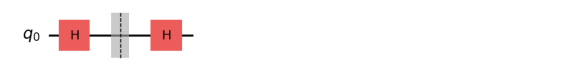

### Clasically-controled gates

Recall the `cx` — a "quantum CNOT" gate. It looked like an `if` statement, but wasn't really that. Instead, it was a quantum entanglement between states of two qubits.

There is an actual `if`-like operation in quantum circuits, but not all hardware currently supports it fully. The idea is simple: measure the state of one or more qubits, and if the result is `1` then apply some gate on one or more other qubits, otherwise do nothing. This requires an aptly called "mid-circuit measurement": measuring the state not just at the end, but in the middle of the circuit, and continuing with other operations after the measurement.

In code it may look like this:

```
qr = QuantumRegister(2, "q")
cr = ClassicalRegister(2, "c")
qc = QuantumCircuit(qr, cr)
qc.h(0)
qc.h(1)
qc.measure(qr, cr)

# Apply an X to qubit 0 if both measurements were 1.
with qc.if_test((cr, 3)):
    qc.x(0)
```


There is one aspect that becomes more important for mid-circuit measurements: Quantum non-demolition (QND) measurement. If you read some introductory literature about quantum computing and the properties of collapsing wave functions, you'll see an example repeated all the time: after measuring a qubit, all subsequent measurements yield the same result, because the wave function had collapsed, and there is no uncertainty anymore. In theory this is correct, but in practice the process of measuring may be destructive. Yes, it would read and report the correctly observed value, but it does not necessarily guarantee that the qubit stays in that state afterwards. In my experience, as of 2024-2025, not all commercially available quantum computers guarantee QND by default. This often comes down to a specific implementation and calibration of a measurement operation.

The measurement is usually not some hardcoded action of the instruments, but instead it can be considered another operation for which calibration is required. A simple measurement operation that does not guarantee quantum non-demolition (or quantum non-destructiveness) is easier to calibrate for.

QND is important for mid-circuit measurements because it may be needed to apply the `if` operation multiple times from the same source qubit.

### Fast feedback

- hardware dependent
- may be limited to specific operations and loci

{pagebreak}

# Chapter 3. Calibration

1. the problem of drift
2. initial calibration
3. re-calibration
4. derived properties and "architectures"
5. dynamic topology

# Chapter 5. Pulse-level control

In the previous chapters, we've treated quantum gates as the fundamental building blocks of our programs. We've seen how a high-level quantum circuit is transpiled into an "ideal" circuit for a specific hardware topology, and then compiled into a time-ordered sequence of analog pulses. For most application developers, this level of abstraction is perfect. You write qc.cx(0, 1), and the compiler and control electronics conspire to execute the best-calibrated CNOT gate the machine has.

But what if that compiled CNOT isn't good enough? What if you want to invent a new gate? Or what if your goal isn't to run an algorithm, but to measure the precise lifetime of your qubit?

For this we need to access a lower level, a bit like a "systems programming" layer of the quantum stack. This is referred to as pulse-level access or control: the features allowing to bypass the high-level gate abstraction and directly command the hardware to produce specific microwave pulses at specific times. This is the layer where quantum physics and electrical engineering meet software, and it's where the most advanced research and performance-tuning happens.

Between 2023 and 2025 I have been involved in the development and maintenance of IQM Pulla (**pul**se **l**eve**l** **a**ccess), so I'm going to use it as an example. It's open source and has very simple and clean model of various abstraction levels, and I'm most familiar with this product.

Note that many quantum hardware vendors do not offer pulse-level access altogether, and some, like IBM, are starting to wind down the support for such feature set.

---

For a software engineer, working at the gate level is like writing in Python or Java. You have a powerful, expressive, high-level language. Working at the pulse level is like dropping down to assembly or even writing GPU shader code. It's more complex and hardware-specific, but it gives you ultimate control and performance.

This control is essential for several key tasks that are critical to advancing the field. The list below is loosely ordered by complexity, starting from conceptually and technically simple tasks and going all the way to "hardcore" mode of experimental access.

- Peeking into the compiled form.
- Tweaking the calibration.
- Defining custom implementations for native gates.
- Defining custom new gates.
- **Hardware Characterization and Benchmarking**: How do you even know what a gate is? How do you find a qubit's exact frequency? You can't do this with a CNOT. You do it by performing a spectroscopy experiment: sweeping a low-power pulse across a range of frequencies and seeing where the qubit "wakes up." This is a fundamental pulse-level task. Similarly, benchmarking gate fidelity (e.g., with Randomized Benchmarking) often requires fine-grained control over the exact pulses being sent.
- **Gate Calibration**: The "default" X gate on a quantum computer is just a pulse that was calibrated to work well. This calibration drifts over time as the hardware's environment changes. Researchers constantly run calibration routines—like the Rabi experiment we'll see later—to find the exact pulse amplitude and duration needed to perform a perfect $\pi$-pulse (an X gate).

## What is a pulse?

So, what is a pulse in this context? As we learned in the control electronics chapter, we control a superconducting qubit by sending microwave signals to it. An arbitrary pulse is defined by a few key parameters:

1. Duration: How long the pulse lasts, typically in nanoseconds (e.g., 20 ns).
2. Carrier Frequency: The "base" frequency of the microwave. This is set to be resonant with the qubit's transition frequency (e.g., 5.0 GHz).
3. Amplitude: The "strength" or "height" of the pulse. This (along with duration) controls the angle of rotation on the Bloch sphere.
4. Phase: The relative phase of the carrier wave. This controls the axis of rotation (e.g., a 0° phase might give an X-gate, while a 90° phase gives a Y-gate).
5. Envelope (Shape): This is the most critical part for advanced control. Instead of just switching the microwave on and off (a "square pulse"), we smoothly "ramp" the amplitude up and down. This shape is called the envelope. A common envelope is a simple Gaussian shape, but complex, optimized shapes (like DRAG) are also used.

Digital control electronics (an Arbitrary Waveform Generator, or AWG) can't directly produce a 5 GHz signal. Instead, they use a standard radio-frequency technique called IQ modulation. The AWG generates two much slower "baseband" signals, called I (In-phase) and Q (Quadrature). In a pulse-level programming environment, a "pulse" is ultimately defined as two arrays of numbers: the I samples and the Q samples.

## Pulse schedules

When you drop to the pulse level, you are no longer building a QuantumCircuit. Instead, you are building a sequence of pulses. In IQM's lingo it's called a `Schedule`. Think of a Schedule as a timeline or a music sequencer. You don't just say "do this, then that." You say "at time $t=0$, do pulse_A on channel_1" and "at time $t=30\text{ns}$, do pulse_B on channel_2."

{pagebreak}

# Chapter 5. Software ecosystems

This chapter is an overview of existing, popular programming frameworks and libraries that allow us to define and manipulate quantum circuits, send them for execution, and retrieve and process the measurement results. The artificial syntax we've used before (e.g. code like `circuit.h(0)`) is a common structure among popular Python-based frameworks, as you are about to see.

{pagebreak}

## SDKs and formats (Qiskit, Cirq, CUDA, QASM, QIR, etc.)

Just as you wouldn't program a classical computer by manually flipping transistors, you don't program a quantum computer by directly manipulating microwave pulses. The raw complexity of the underlying physics and hardware needs to be abstracted away. This is the role of quantum software development kits (SDKs) and standardized data formats. They provide a bridge between the theoretical world of quantum algorithms and the practical, noisy reality of quantum hardware. The primary goal of a quantum framework is to let researchers and developers focus on the logic of their quantum algorithms, not the peculiarities of a specific quantum chip. In practice, many of the popular packages allow you to define quantum circuits, manipulate them, and ultimately execute them on either a simulator or a real quantum processing unit (QPU).

You might notice that the vast majority of these frameworks are based on Python. This isn't a coincidence. Quantum computation, especially in the current era, is an experimental science. The classical code that builds, submits, and analyzes the results of quantum circuits does not need to be exceptionally performant. Python, with its simple syntax and vast ecosystem of scientific libraries like NumPy and Matplotlib, is the perfect language for this kind of orchestration. It allows for rapid prototyping and easy integration with the powerful classical pre- and post-processing that most hybrid quantum algorithms require.

However, this is just the surface. Many popular scientific Python packages use low-level, more performant languages under the hood to do the actual heavy lifting. For example, roughly third of Numpy (a very popular scientific package) is written in C, with a little sparkle of C++ on top. Some parts of Qiskit — a flagship quantum computing framework developed and maintained by IBM — are being written in Rust. This doesn't mean that users (scientists and researchers) have to suddenly learn C or Rust, but rather that you as an aspiring quantum software engineer will likely have to, at some point, deal with the complexities of inter-operability between Python and lower-level languages. As you might have guessed, the reason behind C- or Rust-based parts is performance. Multiplying huge matrices is just not fast enough in Python. Another reason is better compatibility with GPUs (graphics processing unit), which often requires C-compatible bindings.

A mature quantum framework typically offers at least these features:

- Circuit Definition: An intuitive interface to create quantum circuits, add qubits and classical bits, and apply quantum gates from a standard library.
- Circuit Manipulation: Tools to combine smaller circuits into larger ones, inspect their properties (like depth and gate count), and modify them programmatically.
- Transpilation and Optimization: The process of converting an abstract quantum circuit into a new one that can actually run on specific hardware. This involves replacing the gates with the hardware's native gate set and optimizing the circuit to reduce its depth and gate count, minimizing errors.
- Routing: A crucial step that maps the abstract "logical" qubits from the circuit onto the physical qubits of a QPU, taking into account the chip's limited connectivity.
- Execution: A unified interface to send the prepared circuit to different backends, whether they are local simulators, powerful cloud-based simulators, or real quantum hardware from various vendors.
- Result Handling: Tools to retrieve and interpret the measurement outcomes from an experiment, typically providing counts, probabilities, and visualization tools.

We will explore transpilation and routing in detail in the next section, as they are complex and critical steps in making a quantum program executable.

A more comprehensive framework might also offer things like:

- Pulse-level access: A way to break through an abstraction barrier of quantum circuits and at least see, but ideally also modify the pulse representation that is generated from the original quantum circuits.
- Control calibration: Access calibration data obtained from the vendor (usually this means a remote, cloud-based quantum computer) to at least see, but ideally also modify the parameters that define the implementations of native gates for a given QPU.
- Define custom gates. This may be a simple case of defining composite gates from multiple basic gates; or a much more complex task of defining completely new gates from scratch, which usually requires pulse-level access and access to calibration.
{pagebreak}

### Qiskit from IBM

When it comes to popularity and breadth, it's hard to overstate the influence of IBM's Qiskit. It is a comprehensive open-source framework that provides tools for almost every level of the quantum computing stack. Its rich set of features, extensive documentation, and active community have made it the de facto standard for many newcomers and researchers. Qiskit is structured into modular components, including Terra (the core for circuit creation and transpilation), Aer (for high-performance simulations), and modules for studying applications in areas like chemistry and optimization.

Qiskit also used to include pulse-level access features, but in the newer versions IBM had started to wind down that part of the stack. One way to explain this move is to look at IBM's overall strategy and business model when it comes to quantum. Unlike many smaller companies in the industry, IBM does not sell their quantum computer hardware. You cannot simply purchase a machine and install it in your data center. So, ultimately, the scope of what you can do on their hardware is controlled by IBM, and it may not be in their best interest to allow everyone to have a very low-level access to this technology. But perhaps a more fair explanation is that IBM's ambitious roadmap targets high-level goals of functional error correction and fault-tolerant quantum computers. The company is already "in the future", where the notion of controlling individual pulses is as niche and unnecessary for 99.99% of cases as it is in classical computing of 21st century. Just like nobody expects to program voltages on the motherboard to do useful programming today, IBM and other major players don't expect users of their software libraries to deal with pulse level control and calibration.

This makes sense, but the reality on the ground today is that the vast majority of algorithm researchers, scientists, software integrators and admins of quantum computing service providers demand low-level access of some sort. Sometimes they require simple read-only data access to the current state of the calibration and some quality metrics for particular gate implementations (which can be viewed as pulse-level access because those metrics are obtained directly from the concrete numerical parameters of gates, like waveforms, durations of pulses, or even voltages); in other cases, researchers need to define custom gate implementations or brand new gates on the fly, dynamically, and control the way the execution is done. A relatively thin slice of science can be done in this area while being restricted to pure quantum circuits only.

This being said, we will still use Qiskit throughout this book as a language for defining circuits and running quantum jobs. Here is an example of a Qiskit program:

```python
# Define a circuit for 5 qubits
qc = QuantumCircuit(5)

qc.h(0) # Hadamard gate on qubit 0

for qb in range(1, 5):
	qc.cx(0, qb)  # cx gates between qubit 0 and each other gate

qc.barrier()      # barrier gate on all qubits
qc.measure_all()  # measurement operation on all qubits

# Transpile the circuit
qc_transpiled = transpile(qc, backend)
```

### Cirq, Pytket, and others

While Qiskit is dominant, the ecosystem is vibrant with powerful alternatives. Some notable tools include:

Cirq: Developed by Google, Cirq is an open-source framework designed with the Noisy Intermediate-Scale Quantum (NISQ) era in mind. It places a strong emphasis on giving users fine-grained control over circuit construction and optimization to extract the maximum performance from today's noisy hardware. Some people find Cirq's structure and abstractions to be cleaner and simpler to understand compared to Qiskit.

```python
q0, q1 = cirq.LineQubit.range(2)
qc = cirq.Circuit(cirq.H(q0), cirq.CX(q0, q1), cirq.measure(q0, q1, key='b'))
```


**Pytket** is a hardware-agnostic quantum SDK developed by Quantinuum that aims to be a powerful compiler. The focus is on circuit optimization and retargeting capabilities, allowing users to write a circuit once and then efficiently compile it to run on a wide variety of different quantum backends, from IBM to Google to Quantinuum's own trapped-ion machines. The syntax looks very similar to Qiskit:

```python
qc = Circuit(2, 2)
qc.H(0)
qc.CX(0, 1)
qc.measure_all()
```

**Microsoft Q#** (pronounced "q-sharp"), a high-level, open-source programming language developed by Microsoft for writing quantum programs. Q# is included in the Quantum Development Kit (QDK), which also contains simulators and debugging tools.Example of code in Q#:

```
operation BellPair(qb1 : Qubit, qb2 : Qubit) : Unit
{
    H(qb1);
    CNOT(qb1, qb2);
}
```

**PennyLane** is designed with a big of a higher level of abstraction in mind and is geared towards applications in machine learning. But one can still write direct gates using a familiar syntax:

```python
qml.Hadamard(wires=0)
qml.CNOT(wires=[0, 1])
return qml.probs(wires=[0, 1])
```

**AWS Braket** is Amazon’s quantum computing cloud offering, which includes a python-based SDK for creating and submitting quantum programs. Braket acts like a proxy towards multiple vendors, so it's an abstraction that allows you to run the same algorithm on multiple different quantum computers without rewriting the code. Its Python implementation features nice chaining that is familiar to some software engineers:

```python
qc = Circuit().h(0).cnot(control=0, target=1)
```

### QASM

I don't think there was ever a successful "common data format" in the history of computing. There are always competing formats and vendors pursuing their own goals. But there are always attempts to define a common format or a common language, in any area. In the quantum computing this attempt is QASM (Quantum Assembly Language). It is a simple, human-readable text format that describes a sequence of quantum operations. It has become an acceptable standard for representing circuits, allowing for interoperability between different software tools and hardware platforms. Think of it as the assembly language for quantum computers.

However, despite its widespread adoption, OpenQASM 2.0 (the most common version) has significant shortcomings that have prevented it from becoming a true lingua franca. Its most critical limitation is the lack of support for complex classical control flow. Modern hybrid algorithms often require real-time classical processing based on measurement results to decide the next steps in the computation (a feature sometimes called "dynamic circuits"). QASM 2.0 was not designed for this. To work around these limitations, different frameworks often resorted to proprietary extensions, leading to a fragmented ecosystem where a QASM file from one tool might not be fully compatible with another. This defeats the purpose of a universal standard and highlights the need for a more powerful and expressive representation.

Here is an example of OpenQASM code:

```
OPENQASM 3;
include "stdgates.inc";

const n = 3; // number of qubits
qubit[n] q;  // a register 'q' of n qubits
bit[n] c;    // a register 'c' of n classical bits

h q[0];      // Hadamard gate
for k in [0:n-1] {
  cnot q[k], q[k+1]; // Controlled-NOT from control qubit q[k] to target qubit q[k+1]
}

c = measure q; // measure quantum register
```

### CUDA-Q

Not all quantum programming is done in Python. As the field moves towards integrating quantum processors into high-performance computing (HPC) centers, the need for more performant classical languages becomes apparent. CUDA-Q is NVIDIA's answer to this challenge. It is a platform designed for building and running hybrid quantum-classical applications, allowing developers to integrate quantum kernels written in C++ or Fortran with large-scale classical computations running on GPUs. This approach is essential for applications where the classical processing part is a significant bottleneck.

### QIR

While Qiskit, Cirq, and other SDK-based circuits (in the form of Python objects) or QASM are good at representing circuits, they are not great at integrations and inter-operability. Each quantum hardware vendor has to implement adapters for each format. This situation is very similar to various computer architectures (e.g. x86, ARM, RISC, etc.) and/or operating systems (Windows, macOS, Linux, etc.) having to deal with programs in different languages.

In classical compilers, it's common to translate source code into an intermediate representation (IR) before turning it into machine code. Think of it as a middle step: the front end of the compiler takes care of translating from the programming language into IR, and then the back end translates that IR into machine instructions. The nice thing about this setup is that it decouples programming languages from hardware. You can add support for a new language by just writing a new front end, and you can target new hardware by just writing a new back end. The IR sits in the middle and makes everything more modular and reusable.

IRs are usually flexible enough to represent many different languages, and at this stage you can also apply optimizations or reorganize code to make it run more efficiently. Once you know the target hardware, the IR is compiled into actual executable code. This approach means that:

- Lots of different languages can share the same optimization and code generation tools
- A single language can be compiled to many different hardware platforms
- Compiler development becomes more efficient since a lot of the heavy lifting is shared

One notable toolkit in this area is LLVM, a target-independent optimizer and code generator, and a collection of modular and reusable compiler and toolchain technologies. It can be used to develop a frontend for any programming language and a backend for any instruction set architecture.

Quantum Intermediate Representation (QIR) is just this idea applied to quantum computing. It's a common middle layer that sits between quantum programming languages/frameworks and the quantum hardware they run on, similar to LLVM's IR. Instead of every language having to talk directly to every type of hardware, QIR provides a shared way to describe quantum programs in a format that's independent of both the programming language and the hardware. It's built on top of LLVM IR, a widely used compiler framework, and it's being developed by the QIR Alliance (Microsoft is one of the members).

QIR is built on LLVM, which is already used by tons of classical programming languages. Instead of reinventing the wheel, QIR just defines some rules for how quantum constructs should be represented in LLVM IR. The cool part is that this means QIR can naturally handle both classical and quantum logic—super important for hybrid quantum–classical algorithms. It also lets us reuse existing compiler tools and optimizations from the classical world, which saves time and effort. QIR is already being picked up by major players in the quantum space. NVIDIA, Oak Ridge National Lab, IQM, Quantinuum, and Rigetti are all building tools around it.

QIR is not meant to be easily read by humans, but it is still somewhat human readable. Here is an example of a portion of QIR code:

```
define void @BellPair__body(%Qubit* %qb1, %Qubit* %qb2) {
entry:
  call void @__quantum__qis__h(%Qubit* %qb1)
  call void @__quantum__qis__cnot(%Qubit* %qb1, %Qubit* %qb2)
  ret void
}
```
{pagebreak}

# Chapter 6. Hybrid computation

In any discussion about practicalities of running quantum algorithms, there is always an elephant in the room: hybrid computation. For a huge portion of useful algorithms, and even for quantum error correction, a combination of quantum and non-quantum (classical) computation is required.

## What is quantum-classical hybrid computation

A "hybrid algorithm" is a very wide term. It can be as simple as classical control where a measurement result from one qubit controls the flow of execution akin to a simple if/then statement. Or it be a complex machine learning algorithm that needs to run as close to the quantum chip as possible to process some measurement results and affect the parameters of the subsequent gates. Overall, this is still an unsolved problem.

There are 3 distinct types of hybrid computing. Note that this categorization is not an industry standard, and different people may mean different things when they say "hybrid". Heck, even words like "calibration" and "circuit" are ambiguous sometimes. This just shows, again, how young the industry is.

So, the 3 types are:

1. Hybrid remote.
2. Hybrid adjacent.
3. Hybrid tight.

WIP: explain the types.

## MLIR

In Chapter 5 we've seen multiple DSLs (domain-specific languages) or formats to define quantum circuits. One of them was different to everything else: QIR. It was developed because standard LLVM IR is not inherently equipped to represent the unique semantics of quantum operations, such as quantum gates, measurements, or qubit management. QIR currently is limited to gates. But what if we need to combine a rich multi-layered cake of hybrid and pulse and whatever else may be invented in the quantum domain?

To tackle this, some folks are trying to adopt the Multi-Level IR (MLIR) framework, which originates as a sub-project of LLVM. MLIR is a more general and extensible compiler infrastructure designed to address the representation of diverse and domain-specific abstractions. It can be thought of as a "meta-IR," a framework for building other IRs. Instead of a single, fixed set of instructions like LLVM IR, MLIR provides a system for defining "dialects." Each dialect is a collection of custom operations and types tailored to a specific domain, such as quantum computation, high-performance computing, or machine learning accelerators.

A single program representation in MLIR can contain operations from multiple dialects simultaneously. This is exceptionally well-suited for hybrid quantum-classical computing. One can represent the classical control flow (e.g., loops, conditionals) using a standard dialect, while representing the quantum circuit operations (e.g., Hadamard gates, CNOTs) using a quantum-specific dialect, all within a unified representation. One can define a dialect for pulse-level access and then combine it with other existing dialects, achieving a super-hybrid program format of sorts. MLIR's infrastructure allows for progressive lowering, where high-level, abstract operations are gradually transformed into lower-level, more hardware-specific representations through a series of dialect-aware passes. This structured approach allows for optimizations at multiple levels of abstraction, from high-level algorithmic rewrites down to hardware-specific gate decompositions.

The output of all of this is a assembly-like source code, and the big question is how to run it. Many vendors today simply cannot accept QIR or MLIR. They expect only simple circuits in some format equivalent to Qiskit or Cirq, often transmitted to the server in a simple JSON form or some other encoding. These circuits cannot contain arbitrary classical code.

## CPU vs GPU vs FPGA approach

## HPC integration as an example of the challenge

{pagebreak}

# Chapter 7. The challenges

## Real-time or near real-time control
## Simulation vs. real hardware
## Error rates
## Scaling
## Noise and decoherence
## NISQ and QEC
## Where to apply yourself

{pagebreak}

References:

- NASA’s Webb Detects Carbon Dioxide in Exoplanet Atmosphere https://science.nasa.gov/missions/webb/nasas-webb-detects-carbon-dioxide-in-exoplanet-atmosphere/
- https://science.nasa.gov/asset/webb/exoplanet-wasp-39-b-and-its-star-illustration/
- https://www.gsnetwork.com/digital-logic-gates/